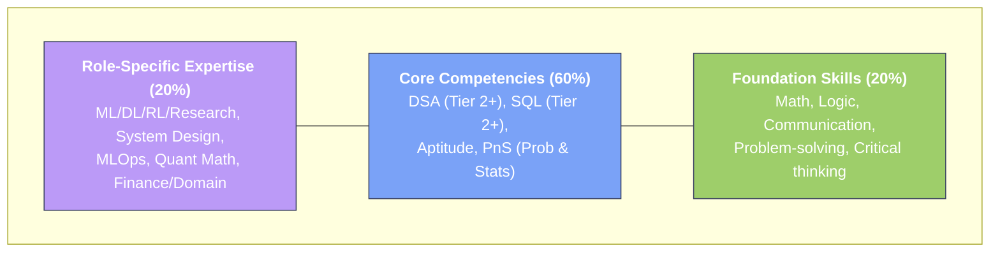

## Overview

* TOC
{:toc}

This guide systematizes the IIT Kharagpur placement landscape by mapping skill tiers, role expectations, and realistic CGPA / package bands, updated with recent (2022–26) statistics where available.[<a href="#ref-1">1</a>, <a href="#ref-2">2</a>, <a href="#ref-3">3</a>, <a href="#ref-4">4</a>]
Numeric success rates and per‑profile package ranges are indicative for planning, not official CDC data; where exact numbers exist (offers, median packages, branch‑wise placement), they are explicitly cited.[<a href="#ref-5">5</a>, <a href="#ref-2">2</a>, <a href="#ref-1">1</a>]

## 1. Recent Placement Snapshot (IIT Kharagpur)

### 1.1 Institute‑level highlights (2022–26)

- In the 2024 placement season, 1,747 students were placed across B.Tech, Dual Degree, and integrated MSc programs, reflecting strong recruiter demand across software, analytics, core engineering, and finance roles.[<a href="#ref-2">2</a>]
- NIRF‑reported median package for 4‑year UG programs at IIT Kharagpur rose from about ₹18.75 LPA in 2022 to around ₹24 LPA in 2023, indicating a steady upward trend in core IIT Kharagpur salaries.[<a href="#ref-4">4</a>, <a href="#ref-2">2</a>]
- In the 2025 season, media reports note around 1,000 offers within the first three days, with a highest package near ₹2.14 crore and nine students crossing the ₹1 crore mark, showing continued demand for top performers.[<a href="#ref-3">3</a>, <a href="#ref-2">2</a>]
- In the 2025–26 Phase‑1 drive, reports mention roughly 1,501 offers (including ~457 PPOs) and a highest CTC of about ₹2.44 crore, continuing the trend of very high outliers at the top end.[<a href="#ref-1">1</a>]

### 1.2 Branch‑wise placement reality check (2023–24, unofficial)

Unofficial branch‑wise stats discussed by students for the 2023–24 season suggest the following approximate placement percentages (students with at least one offer) for core B.Tech branches:[<a href="#ref-5">5</a>]

| Branch (B.Tech) | Approx. placed share |
|-----------------|----------------------|
| Computer Science | ~92%[<a href="#ref-5">5</a>] |
| Electronics & Electrical | ~87%[<a href="#ref-5">5</a>] |
| Instrumentation | ~84%[<a href="#ref-5">5</a>] |
| Electrical | ~73%[<a href="#ref-5">5</a>] |
| Mechanical | ~84%[<a href="#ref-5">5</a>] |
| Metallurgy & Materials | ~76%[<a href="#ref-5">5</a>] |
| Civil | ~52%[<a href="#ref-5">5</a>] |
| Chemical | ~73%[<a href="#ref-5">5</a>] |
| Aerospace | ~62%[<a href="#ref-5">5</a>] |

These numbers are from an informal student‑shared summary of the official report and are best treated as order‑of‑magnitude indicators rather than exact official statistics.[<a href="#ref-5">5</a>]

## 2. CGPA and Eligibility at IIT Kharagpur

### 2.1 Degree categories and CGPA thresholds (academic)

- From the 2025–26 academic cycle onward, IIT Kharagpur awards a **B.Tech (Honours)** degree to students with a final CGPA of **6.0 or above**, while students with **5.0–5.9 CGPA** who complete all required courses receive a **B.Tech (Pass)** degree.[<a href="#ref-6">6</a>]
- Earlier, only B.Tech (Honours) existed, with 6.0 as the minimum graduating CGPA; students below 6.0 had to improve CGPA via re‑exams to graduate at all.[<a href="#ref-6">6</a>]

These reforms primarily affect degree nomenclature and stress levels, but for placements, companies still care mainly about your **current CGPA at the time of shortlisting**.

### 2.2 Typical CGPA cut‑off patterns for placements

Official company‑wise cut‑offs are not published centrally; however, student discussions and sample JD screenshots across IITs (including IIT Kharagpur) show clear patterns:[<a href="#ref-7">7</a>, <a href="#ref-8">8</a>]

- Many product and analytics recruiters specify **minimum 7.0 CGPA** as eligibility; IBM, for example, commonly lists 7.0+ as a minimum in campus JDs.[<a href="#ref-7">7</a>]
- KGP students report that with **≈7.0 CGPA, you are eligible for roughly 60–75% of companies**, while **8.0+ opens most software / analytics roles**, and **8.5+ is considered “very safe” for almost all non‑quant roles that come to top IITs.**[<a href="#ref-8">8</a>]
- A small subset of high‑end **quant / HFT / research labs** either:
  - demand **very high CGPA (8.5–9.0+)**, or
  - shortlist only the top X students in each branch, effectively imposing a higher CGPA bar.

These are patterns, not rules; each company’s form on CDC will state the exact eligibility for that drive.

### 2.3 Practical CGPA tiers for KGP placements

A pragmatic way to think about CGPA bands for IIT Kharagpur placements (especially for B.Tech / Dual) is:

| CGPA band | What it usually means on campus (KGP‑oriented) |
|-----------|-----------------------------------------------|
| **9.0+** | Eligible for almost every role, including most quant, top product, research, and elite intern conversions; very strong signal for CDC shortlists (but still not sufficient without skills). |
| **8.0–8.9** | Comfortable for most software, ML, analytics, PM‑like, BA, DevOps/SRE roles; most Tier‑1 and Tier‑2 recruiters open to you, barring a few quant / research exceptions.[<a href="#ref-8">8</a>] |
| **7.0–7.9** | Solid but not elite; you may miss some top‑tier/quant roles, but will be eligible for a majority of SWE, DA, QA, BA, many ML roles, and a good number of core companies.[<a href="#ref-8">8</a>] |
| **6.0–6.9** | Meets degree‑honours requirement; some product / analytics / core roles and a subset of software roles will still open, but Tier‑1 product and quant roles will often be closed; you will rely more on skill, projects, and off‑campus options. |
| **5.0–5.9** | B.Tech (Pass) band from 2025–26 onward; on‑campus opportunities will be more limited and heavily profile‑specific; off‑campus hustling and strong project / internship portfolio become critical.[<a href="#ref-6">6</a>] |

### 2.4 Suggested target CGPA by profile (KGP context)

These are **recommended safety targets**, not hard cut‑offs; individual companies and years can be stricter or more lenient.

| Profile | Safe CGPA target (on campus) | Notes |
|--------|------------------------------|-------|
| SWE (general) | **≥ 8.0** | 7.0–7.9 workable if DSA/CP is strong; 8.5+ improves Tier‑1 coverage. |
| System Design‑heavy SWE | **≥ 8.0–8.5** | Many such roles come from big tech / high‑pay product; shortlists often skew to higher CGPA. |
| ML Engineer | **≥ 8.0** | Strong projects + research weightage can compensate for slightly lower CGPA in some startups / labs. |
| ML Researcher | **≥ 8.0–8.5** | For top labs (e.g., FAANG research, elite MS/PhD tracks) higher CGPA plus publications helps.
| Data Analyst / Analytics | **≥ 7.5–8.0** | SQL + stats + case skills are critical; some analytics teams open at 7.0 but prefer higher.
| Product Manager | **≥ 7.5** | Many PM roles care more about communication, product sense, and internship pedigree; 8.0+ is nice to have.
| Business Analyst / Consultant | **≥ 7.0–7.5** | Case performance and communication can outweigh a small CGPA difference.
| Quantitative Analyst | **≥ 8.5** | HFT/quant recruiters aggressively filter by CGPA + branch; strong math/CP mandatory.
| QA / Test Engineer | **≥ 7.0** | Deep SQL + testing portfolio helps; some roles open down to 6.5.
| DevOps / SRE | **≥ 7.5** | Strong hands‑on infra work can compensate, but higher CGPA gives more shortlist stability.

## 3. Overall Assessment Formula

For IIT Kharagpur technical/professional roles, a useful conceptual formula is:

**OA = DSA + SQL + Aptitude + PnS + X**

Where **X** is the profile‑specific component (ML, Product, Quant, System Design, etc.).

Approximate **weightage across most tech/analytics profiles**:

- **DSA / algorithms**: 35–40%
- **SQL / data handling**: 20–25%
- **Aptitude (quant, logical, verbal)**: 15–20%
- **Probability & Statistics (PnS)**: 10–15%
- **X (profile‑specific depth)**: 10–40% depending on the role

## 4. Core Components (Common for All Profiles)

### 4.1 DSA (Data Structures & Algorithms) – 35–40% weight

#### Level classification

**Tier 1 – Foundational**  
Used heavily by DA, QA, some BA roles (and as a filter for almost everyone):
- Topics: Arrays, strings, basic hashing, simple sorting, simple recursion.
- LeetCode level: Easy + simple Medium (~60% Easy, 40% Medium).
- Codeforces rating ballpark: **1200–1400**.
- Time complexity: Able to reason about and derive simple complexities.
- Example problems: Two Sum, merge sorted arrays, palindrome check.

**Tier 2 – Intermediate**  
Core competency for SWE, ML Engineer, and most serious dev roles:
- Topics: Linked lists, stacks/queues, trees, basic DP, graphs (BFS/DFS), heaps, advanced hashing.
- LeetCode level: Mostly Medium (70% Medium, 30% Hard).
- CF rating ballpark: **1500–1700**.
- Time complexity: Able to optimize to near‑optimal complexity.
- Example problems: LCA, topological sort, word ladder, merge k sorted lists.

**Tier 3 – Advanced**  
Expected for serious SWE / System Design / infra roles:
- Topics: Complex DP, advanced graphs (Dijkstra, Floyd‑Warshall), greedy with proofs of correctness.
- LeetCode level: Mixed Medium/Hard (50% each).
- CF rating ballpark: **1800–2100**.
- Time/space complexity: Comfortable with space‑time trade‑offs.
- Example problems: Minimum cost to hire K workers, Trapping Rain Water II, Alien Dictionary.

**Tier 4 – Mastery**  
Competitive programming level, useful for top‑tier SWE/Quant:
- Topics: Segment trees, Fenwick trees, advanced trie variants, game theory basics, bitmask DP.
- LeetCode level: Mostly Hard.
- CF rating ballpark: **2000+**.
- Example problems: Skyline problem, Word Search II, number of connected components in a huge graph.

#### Profile‑wise DSA requirements

- **SWE**: Tier 3 minimum; Tier 4 strongly preferred for top product/quant‑adjacent SWE.
- **ML Engineer**: Tier 2–3 (intermediate–advanced) plus coding hygiene.
- **System Design Engineer**: Tier 3.
- **Product Manager**: Tier 1–2 for screening.
- **Data Analyst**: Tier 1–2.
- **ML Researcher**: Tier 2–3; projects and math matter more than Tier 4 CP.
- **Business Analyst**: Tier 1.
- **Quantitative Analyst**: Tier 3 (often with CP‑heavy interviews).

### 4.2 SQL (Databases & Query Optimization) – 20–25% weight

#### Level classification

**Tier 1 – Basic**  
- Topics: SELECT, WHERE, INNER/LEFT/RIGHT JOIN, GROUP BY, HAVING, basic aggregates.
- Used by: DA, BA, many SWE roles that touch data.
- Complexity: Simple multi‑table joins and filters.
- LeetCode SQL: Mostly Easy (80% Easy, 20% Medium).

**Tier 2 – Intermediate**  
- Topics: Window functions (ROW_NUMBER, RANK, DENSE_RANK, LEAD, LAG), CTEs (WITH), subqueries.
- Used by: SWE, ML Engineer, DA, QA.
- Complexity: Complex aggregations, ranking, reporting queries.
- LeetCode SQL: Medium (roughly 50% Medium, 50% Hard over time).

**Tier 3 – Advanced**  
- Topics: Indexing, query plans (EXPLAIN), partitioning, materialized views.
- Used by: System Design Engineer, senior SWE, infra teams.
- Complexity: Performance tuning at 100M+ rows.

**Tier 4 – Expert**  
- Topics: Transactions, ACID, isolation levels, locking, deadlocks.
- Used by: DB engineers, some system design / infra roles.

#### Profile‑wise SQL requirements

- **SWE**: Tier 2.
- **ML Engineer**: Tier 2–3.
- **Data Analyst**: Tier 2–3 (critical skill).
- **System Design Engineer**: Tier 3.
- **Product Manager**: Tier 1 (for data‑driven decisions).
- **Business Analyst**: Tier 1–2.
- **Researcher**: Tier 1.
- **Quantitative Analyst**: Tier 2 (for data pulls and checks).

### 4.3 Aptitude (Quantitative, Logical, Verbal) – 15–20% weight

- **Quantitative**: Speed arithmetic, percentages, ratios, basic combinatorics, probability, permutations.
- **Logical Reasoning**: Series, patterns, puzzles, syllogisms.
- **Verbal**: Reading comprehension, basic grammar, vocabulary.

Profile‑wise importance:
- **Critical for**: Quantitative Analyst, many PM and consulting‑type roles.
- **Important for**: All SWE, ML, DA (as test filters).
- **Moderate for**: Researchers, BA roles after initial screens.

### 4.4 Probability & Statistics (PnS) – 10–15% weight

#### Level classification

**Tier 1 – Foundational**  
- Topics: Basic probability, conditional probability, expectation/variance, common distributions (normal, binomial), mean/median/mode.
- Used by: DA, some ML, QA for A/B sanity.

**Tier 2 – Intermediate**  
- Topics: Hypothesis testing, correlation vs causation, p‑values, confidence intervals, classical A/B testing.
- Used by: ML Engineer, SWE in data teams, DA (critical).

**Tier 3 – Advanced**  
- Topics: Bayesian inference, experiment design, power analysis, advanced modeling.
- Used by: Researchers, advanced ML, Quantitative Analysts.

PnS also overlaps heavily with the **"soft" problem‑solving mindset**:
- System design thinking.
- Debugging and edge‑case handling.
- Communication and reasoning about uncertainty.

### 4.5 System Design – 0–40% weight (role‑dependent)

#### Level classification

**Tier 1 – Basic**  
- Used by: Intern roles, junior devs.
- Topics: Scalability basics, vertical vs horizontal scaling, SQL vs NoSQL trade‑offs.
- Interview time: 15–20 minutes in mixed rounds.

**Tier 2 – Intermediate**  
- Used by: SWE, ML Engineer, DevOps.
- Topics: Caching (Redis), message queues (Kafka/RabbitMQ), microservices basics, load balancing.
- Interview time: 20–30 minutes.
- Example systems: Instagram feed, URL shortener, rate limiter.

**Tier 3 – Advanced**  
- Used by: Senior SWE, System Design Engineer, SRE.
- Topics: Distributed consensus, sharding, eventual consistency, CAP theorem.
- Interview time: 30–45 minutes.
- Example systems: Uber, YouTube recommendation system.

**Tier 4 – Expert**  
- Used by: Principal / staff engineers, infra specialists.
- Topics: Circuit breakers, chaos engineering, disaster recovery, multi‑region design.
- Interview time: 45–60 minutes.

#### System design components to master

- **Scalability**: Horizontal/vertical scaling, load balancing (round‑robin, consistent hashing).
- **Storage**: SQL/NoSQL trade‑offs, sharding, replication.
- **Caching**: Redis, cache invalidation strategies (LRU, TTL, write‑through/write‑back).
- **Messaging**: Kafka, RabbitMQ, event‑driven architectures.
- **Networking**: DNS, CDN, API gateways, rate limiting.
- **Databases**: Indexing, query optimization, partitioning.
- **Microservices**: Service discovery, contracts, observability.
- **Monitoring**: Metrics, logging, tracing, alerting.

## 5. Profile‑Specific Requirements (X Component)

Below, "Success rate" is **relative/qualitative**, not official CDC data; role‑wise success rates are not publicly reported and vary by branch, market, and year.

### 5.1 Software Engineer (SWE)

**Formula**: X = 0 (pure generalist dev + systems thinking).

**Assessment breakdown (typical)**:
- DSA: 40% (Tier 3).
- SQL: 15% (Tier 2).
- Aptitude: 15%.
- PnS: 10%.
- System Design: 20% (Tier 2).

**Interview structure (typical pattern at big tech/product):**
- Rounds 1–2: Coding (2–3 problems, 60–75 minutes total).
- Round 3: System Design (30–45 minutes).
- Round 4: Behavioral + culture fit (30 minutes).

**Key recruiters (illustrative, vary by year)**:
- Large product/big tech: Amazon, Microsoft, Google (select years), Apple (limited), high‑scale Indian product companies.[<a href="#ref-9">9</a>, <a href="#ref-2">2</a>]
- Fintech/product: Flipkart, Goldman Sachs, Paytm, Swiggy, Meesho and other startups.[<a href="#ref-9">9</a>, <a href="#ref-2">2</a>]

**CF/CP expectation**: Codeforces 1700–2000 is a good target for strong SWE interviews.

**Preparation roadmap (≈6 months)**:
1. Month 1: Tier 1 DSA fundamentals (arrays, strings, hashing).
2. Months 2–3: Tier 2 (trees, graphs, heaps, DP basics).
3. Month 4: Tier 3 DSA + system design basics.
4. Month 5: System design Tier 2; SQL and debugging practice.
5. Month 6: Mock interviews + company‑specific patterns + behavioral.

**Rules of thumb**:
- 150–200 LeetCode problems (majority Medium, some Hard) with spaced revision.
- At least 8–10 serious mocks (peers / online platforms).
- Clear articulation of trade‑offs and thought process.

### 5.2 Software Engineer – System Design Specialist

**Formula**: X = Advanced System Design.

**Assessment breakdown**:
- DSA: 30% (Tier 3).
- SQL: 10% (Tier 3 focus on optimization).
- System Design: 50% (Tier 3).
- Aptitude: 5%.
- PnS: 5%.

**Typical interview pattern**:
- Round 1: Coding (2 problems, 60 minutes).
- Rounds 2–3: Deep‑dive system design (45 minutes each).
- Round 4: Behavioral.

**Typical recruiters**:
- Big‑tech back‑end teams, large product infra teams, some high‑end startups and cloud providers (Google, Meta, Stripe, Uber, AWS teams in certain years).

**CF level**: 1800–2100 helpful but design skills and real‑world exposure matter more.

**Preparation roadmap (≈7 months)**:
1. Months 1–2: DSA Tier 3 mastery.
2. Month 3: System design Tier 2 patterns.
3. Months 4–5: Tier 3 (distributed systems, CAP, consistency models).
4. Month 6: Deep‑dives into architectures of Instagram, Netflix, Uber, etc.
5. Month 7: Design‑only mocks, edge‑case drills.

**Must‑study systems**:
- Instagram feed, YouTube (video + recommenders), Uber (geospatial + real‑time), consistent hashing, rate limiting.

### 5.3 ML Engineer

**Formula**: X = Basic ML + Development + System Design for ML.

**Assessment breakdown**:
- DSA: 30% (Tier 2–3).
- SQL: 15% (Tier 2).
- Basic ML: 20%.
- Development / MLOps: 15%.
- System design (ML systems): 15%.
- Aptitude + PnS: 5%.

**Core ML topics**:
- Supervised learning: Linear/logistic regression, decision trees, random forests, SVM, boosting (XGBoost/LightGBM).
- Unsupervised learning: K‑means, hierarchical clustering, PCA, DBSCAN.
- Evaluation: Cross‑validation, confusion matrix, ROC‑AUC, precision/recall, F1.
- Feature engineering: Scaling, encoding, feature selection, dimensionality reduction.
- Hyperparameter tuning: Grid/random search, Bayesian optimization.

**MLOps / development topics**:
- Deployment: REST APIs (FastAPI/Flask), batch vs real‑time inference, containerization (Docker) and basic Kubernetes.
- Pipelines: ETL, data validation, data quality.
- Tooling: MLflow, DVC, Airflow/Kubeflow.
- A/B testing: Experiment design, significance, power.
- Monitoring: Model drift detection, performance + logging.

**ML system design examples**:
- Recommendation systems, fraud detection, search ranking, personalization engines, feature stores.

**Typical interview pattern**:
- Round 1: DSA (Tier 2, 60 minutes).
- Round 2: ML fundamentals + coding/implementation (60–90 minutes).
- Round 3: ML‑specific system design (45 minutes).
- Round 4: Behavioral.

**Preparation roadmap (≈7 months)**:
1. Month 1: DSA Tier 2 consolidation.
2. Months 2–3: Supervised + unsupervised ML + evaluation.
3. Month 4: Feature engineering + tuning + basic feature stores.
4. Month 5: MLOps (Docker, APIs, monitoring).
5. Month 6: ML system design.
6. Month 7: One strong end‑to‑end project and mocks.

### 5.4 ML Researcher

**Formula**: X = Basic ML + Deep Learning + Reinforcement Learning.

**Assessment breakdown**:
- DSA: 25% (Tier 2–3).
- SQL: 5%.
- Basic ML: 15%.
- Deep Learning: 25%.
- Reinforcement Learning: 20%.
- Aptitude + PnS: 10%.

**Deep learning topics**:
- Neural networks, optimization, regularization.
- CNNs: Architectures like AlexNet, VGG, ResNet.
- RNNs: LSTM/GRU, sequence modeling, attention.
- Transformers: Self‑attention, encoder–decoder, BERT/GPT style models.
- Applications: CV (classification, detection, segmentation), NLP (embeddings, seq2seq, transformers).

**Reinforcement learning topics**:
- MDPs, value functions, policies.
- Q‑learning, DQN; policy gradient, PPO, A3C.
- Actor–critic methods.

**Preparation roadmap (≈8 months)**:
1. Month 1: DSA Tier 2 + ML basics.
2. Months 2–3: DL fundamentals (PyTorch preferred), classic architectures.
3. Months 3–4: Modern architectures (ResNet, ViT, BERT).
4. Month 5: RL fundamentals + small projects.
5. Month 6: Research paper reading (1 paper/week), SOTA survey.
6. Month 7: Implement 1–2 papers from scratch, experiments.
7. Month 8: Research talk prep + mocks.

### 5.5 Data Analyst (DA)

**Formula**: X = Basic ML + Advanced Statistics + Business Acumen.

**Assessment breakdown**:
- DSA: 15% (Tier 1–2).
- SQL: 30% (Tier 2–3, critical).
- Aptitude: 15%.
- Statistics (PnS): 20% (Tier 2–3).
- Business acumen: 15%.
- Basic ML: 5%.

**Advanced statistics topics**:
- Hypothesis testing: t‑test, chi‑square, ANOVA, non‑parametric tests.
- Distributions: Normal, binomial, Poisson, exponential, beta.
- Bayesian intuition: Prior/posterior, conjugacy.
- A/B testing: Significance, power, sample size, multiple testing.
- Time series: Stationarity, ARIMA, seasonality.
- Experiment design: Randomization, blocking, factorial designs.

**Business acumen topics**:
- Metrics: CAC, LTV, retention, funnels, conversion rate.
- Cohort analysis, attribution, ROI calculation.
- SQL optimization for analytics.
- Data storytelling and visualization.

**Tools**:
- SQL (primary weapon), Tableau/Power BI/Looker, Python (Pandas, NumPy, Matplotlib/Seaborn), Excel (advanced functions, pivots, basic macros).

### 5.6 Product Manager (PM)

**Formula**: X = Product Sense + Strategy + Communication.

**Assessment breakdown**:
- DSA: 10% (Tier 1 screen).
- SQL: 20% (Tier 1–2 for data‑driven decisions).
- Aptitude: 10%.
- PnS (soft/problem‑solving): 25%.
- Business acumen: 20%.
- Product sense: 15%.

**Product sense topics**:
- User research, empathy mapping, user personas.
- Market sizing, competitive analysis.
- Feature prioritization (RICE, MoSCoW, etc.).
- Product–market fit, growth loops, virality.

**Strategy & business topics**:
- Business models and monetization.
- Go‑to‑market strategies.
- Unit economics, pricing.
- Stakeholder management.

### 5.7 Business Analyst (BA) / Consultant

**Formula**: X = Business Acumen + Communication + Analytics.

**Assessment breakdown**:
- DSA: 10% (Tier 1).
- SQL: 20% (Tier 1–2).
- Aptitude: 20% (quant + logic).
- PnS / problem‑solving: 30%.
- Business acumen: 20%.

Core competencies:
- Requirements gathering, documentation.
- Process mapping and optimization.
- Stakeholder management and change management.
- Data‑driven recommendations.

### 5.8 Quantitative Analyst (Quant)

**Formula**: X = Advanced Math + Finance + Optimization.

**Assessment breakdown**:
- DSA: 25% (Tier 3, algorithmic thinking).
- SQL: 15% (Tier 2).
- Aptitude: 20% (probability‑heavy).
- Statistics: 25% (Tier 3, Bayesian and time series).
- Finance & optimization: 15%.

Advanced math and finance topics include:
- Linear algebra (eigenvalues, SVD), multivariable calculus, stochastic processes.
- Time series (ARIMA, GARCH), regression, multivariate analysis.
- Options pricing (Black–Scholes, binomial), portfolio optimization, risk metrics (VaR, CVaR, Greeks).

### 5.9 QA Engineer / Test Engineer

**Formula**: X = Testing Frameworks + Automation + Domain Knowledge.

**Assessment breakdown**:
- DSA: 20% (Tier 1–2).
- SQL: 25% (Tier 2; data validation).
- Aptitude: 10%.
- PnS / problem‑solving: 20%.
- Testing tools & frameworks: 25%.

Testing topics:
- Manual testing, test case design, exploratory testing.
- Automation: Selenium/Cypress, JUnit/TestNG, API testing (Postman), performance testing.
- CI/CD integration of tests, bug tracking and reporting.

### 5.10 Infrastructure / DevOps / SRE Engineer

**Formula**: X = System Design + DevOps + Linux + Networking.

**Assessment breakdown**:
- DSA: 15% (Tier 1–2; problem‑solving focus).
- SQL: 10% (Tier 1–2).
- System design: 40% (Tier 3, infra‑focused).
- DevOps tools: 20%.
- Linux & networking: 15%.

Core topics:
- Docker, Kubernetes, IaC (Terraform/Ansible), CI/CD (Jenkins, GitHub Actions).
- Cloud basics (AWS/GCP/Azure), monitoring stacks (Prometheus, Grafana, ELK).
- SRE: SLO/SLI, error budgets, incident response, reliability engineering.

## 6. Quick Reference Skill Matrix (Qualitative)

This matrix keeps your original intent but replaces pseudo‑precise success rate numbers with **relative competition labels** (since exact role‑wise success rates aren’t reported by CDC).

| Profile | DSA Level | SQL Level | System Design | Statistics | Programming Importance | Soft Skills Importance | CF Rating Target | Typical Package Band (KGP / top IITs) |
|--------|-----------|-----------|---------------|-----------|------------------------|------------------------|------------------|---------------------------------------|
| SWE | Tier 3 | Tier 2 | Tier 2 | Tier 1 | Critical | High | 1700–2000 | ~₹22–28 LPA core band; very top offers much higher in rare cases.[<a href="#ref-2">2</a>, <a href="#ref-4">4</a>] |
| System Design SWE | Tier 3 | Tier 3 | Tier 3 | Tier 1 | High | High | 1800–2100 | Often ₹26–35 LPA+ for strong roles; some outliers above.[<a href="#ref-2">2</a>, <a href="#ref-4">4</a>] |
| ML Engineer | Tier 2–3 | Tier 2 | Tier 2 | Tier 2 | Critical | Medium | 1700–2000 | ~₹24–32 LPA typical for strong ML/DS roles at top IITs.[<a href="#ref-2">2</a>, <a href="#ref-4">4</a>] |
| ML Researcher | Tier 2–3 | Tier 1 | Tier 1 | Tier 2 | Critical | Medium | 1600–1900 | ~₹26–35 LPA equivalent value (including research stipends) in top offers.[<a href="#ref-10">10</a>, <a href="#ref-4">4</a>] |
| Data Analyst | Tier 1–2 | Tier 2–3 | Tier 1 | Tier 2–3 | Medium | High | 1500–1800 | ~₹18–24 LPA for analytics‑heavy roles.[<a href="#ref-11">11</a>, <a href="#ref-4">4</a>] |
| Product Manager | Tier 1 | Tier 1–2 | Tier 1 | Tier 1 | Low | Critical | 1200–1400 | ~₹20–28 LPA; equity/bonus can be significant.[<a href="#ref-10">10</a>, <a href="#ref-11">11</a>] |
| Business Analyst | Tier 1 | Tier 1–2 | Tier 1 | Tier 1 | Medium | Critical | 1300–1500 | ~₹16–22 LPA typical consulting/BA band.[<a href="#ref-11">11</a>] |
| Quant Analyst | Tier 3 | Tier 2 | Tier 2 | Tier 3 | Critical | Medium | 1800–2100 | Often ₹25–40 LPA+ with large upside via bonuses at HFT/quant firms.[<a href="#ref-2">2</a>, <a href="#ref-4">4</a>] |
| QA Engineer | Tier 1–2 | Tier 2 | Tier 1 | Tier 1 | High | Medium | 1400–1600 | ~₹18–24 LPA typical; some product firms higher.[<a href="#ref-11">11</a>] |
| DevOps/SRE | Tier 1–2 | Tier 1–2 | Tier 3 | Tier 1 | High | Medium | 1500–1800 | ~₹24–32 LPA for solid infra roles.[<a href="#ref-2">2</a>, <a href="#ref-4">4</a>] |

## 7. KGP‑Specific Trend Insights

### 7.1 Offers and salary bands

- IIT Kharagpur’s highest packages in recent years have frequently exceeded **₹2 crore CTC**, though these are rare, specialized offers (often quant/HFT or top international roles).[<a href="#ref-2">2</a>, <a href="#ref-3">3</a>, <a href="#ref-4">4</a>, <a href="#ref-1">1</a>]
- The **median package for 4‑year UG** programs has been in the high‑teens to mid‑20s LPA (₹18–24 LPA) in 2022–23, which aligns with your core "₹20–28 LPA" bands for mainstream SWE roles.[<a href="#ref-4">4</a>, <a href="#ref-2">2</a>]
- Student discussions point out that a non‑trivial number of offers are still in the **₹4–6 LPA** range in some branches/roles, reflecting the long tail that is often hidden by headline averages.[<a href="#ref-5">5</a>]

### 7.2 Timing of recruitment

The broad timeline in your original framework is consistent with observed patterns across IITs:[<a href="#ref-12">12</a>, <a href="#ref-9">9</a>]

- **July–August**: Internship interviews (ML/research‑heavy, pre‑placement offers later).[<a href="#ref-12">12</a>]
- **September–October**: Early placement drive, PPO confirmations, first wave of full‑time roles.[<a href="#ref-9">9</a>]
- **October–November**: Peak hiring season; majority of Day‑1/Day‑2 companies visit in this window.[<a href="#ref-9">9</a>]
- **December–February**: Late‑season and off‑campus hiring; super‑senior or second‑chance opportunities.

## 8. CGPA‑Aware Preparation Timelines

These roadmaps integrate your time‑based plans with realistic expectations given CGPA and current skill level.

### 8.1 If you have 3 months (Emergency Mode)

- **Realistic outcome**: SWE/DA/QA at mid‑tier firms; aim for roles whose eligibility you meet with your current CGPA.
- **Focus**: DSA up to Tier 2, SQL up to Tier 2, core aptitude. De‑prioritize heavy system design, advanced ML/research, or quant.
- **Target package band**: ₹16–20 LPA on campus is reasonable for strong execution in this window; more is possible but should be treated as upside.[<a href="#ref-2">2</a>]

### 8.2 If you have 4–6 months (Standard Mode)

- **Realistic outcome**: Mainstream SWE, DA, BA, QA, some DevOps roles.
- **Focus**: DSA Tier 2–3, SQL mastery, basic system design, then branch into your chosen X component.
- **Target package band**: ₹20–26 LPA realistic range for well‑prepared candidates across branches.[<a href="#ref-4">4</a>, <a href="#ref-2">2</a>]

### 8.3 If you have 6–8 months (Optimal Mode)

- **Realistic outcome**: Competitive for strong SWE, ML Engineer, some system‑design‑oriented SWE and infra roles.
- **Focus**: DSA Tier 3, solid system design, plus deep dive into ML / infra / analytics / product as per profile.
- **Target package band**: ₹24–32 LPA core band, with some exposure to high‑end offers.

### 8.4 If you have 8+ months (Mastery Mode)

- **Realistic outcome**: Prepared for almost any profile, including Quant and ML Research, provided CGPA and projects support it.
- **Focus**: Follow role‑specific roadmaps; target Tier 3–4 in DSA, strong PnS, deep X component.
- **Target package band**: ₹26–40 LPA+ possible with the right mix of CGPA, skills, and luck; median expectations should be closer to institute‑wide medians.

## 9. Holistic Skill Development Pyramid

The key idea is that **role‑specific expertise sits on top of solid fundamentals**; most KGP recruiters test the core layers far more than the top 20% except for highly specialized roles.

## 10. Universal Success Factors (KGP‑Oriented)

- **Fundamentals first**: Aim for at least Tier 2 in DSA and SQL, plus Tier 1 PnS and aptitude.
- **CGPA hygiene**: For KGP, try to stabilize at or above **8.0 CGPA** if you are targeting Tier‑1 software/ML/analytics roles and **8.5+** for serious quant ambitions.[<a href="#ref-8">8</a>]
- **Projects**: 2–3 well‑built, end‑to‑end projects carry more weight than a long list of half‑finished repos.
- **Mocks**: 10–15 mocks (coding + system design + HR) before Day 1/2 strongly reduce variance.
- **Company research**: Track at least 10 key companies’ tech stacks, interview styles, and past patterns.

## 11. Community‑Driven Resources (DSA, ML, System Design, Product)

This section curates resources that are repeatedly recommended by IIT KGP students and wider Reddit / X / YouTube communities. Treat it as a **menu**; pick 1–2 per category and go deep instead of hoarding links.[<a href="#ref-13">13</a>, <a href="#ref-14">14</a>, <a href="#ref-15">15</a>, <a href="#ref-16">16</a>, <a href="#ref-17">17</a>, <a href="#ref-18">18</a>, <a href="#ref-19">19</a>, <a href="#ref-20">20</a>, <a href="#ref-21">21</a>]

### 11.1 DSA & Competitive Programming

**Structured roadmaps**

- **Striver A2Z + SDE Sheet (takeUforward)**  
  Widely cited as the most structured free roadmap for going from basics to interview‑level DSA; many KGP and non‑KGP students follow A2Z for fundamentals and then the SDE sheet for refinement.[<a href="#ref-18">18</a>, <a href="#ref-13">13</a>]
- **AlgoZenith (AZ Premium / cohorts)**  
  Frequently praised by KGP students for depth and contest‑style assignments; best suited for those who already know DSA basics and want to push towards Codeforces Expert or strong CP levels.[<a href="#ref-14">14</a>, <a href="#ref-22">22</a>, <a href="#ref-17">17</a>, <a href="#ref-19">19</a>, <a href="#ref-20">20</a>, <a href="#ref-21">21</a>, <a href="#ref-18">18</a>]
  Community feedback highlights:
  - Excellent advanced coverage and structured 6‑month roadmap targeting internships/placements.[<a href="#ref-17">17</a>, <a href="#ref-19">19</a>]
  - Not ideal for absolute beginners; you should know basic DSA/CP concepts first.[<a href="#ref-22">22</a>, <a href="#ref-19">19</a>, <a href="#ref-21">21</a>, <a href="#ref-14">14</a>]
  - Considered somewhat expensive but many seniors report good outcomes when they followed it seriously.[<a href="#ref-22">22</a>, <a href="#ref-18">18</a>]

**Practice platforms**

- **LeetCode**: For company‑tagged interview problems and blind‑75 style lists.
- **Codeforces / AtCoder**: For improving speed and problem‑solving depth; repeatedly mentioned on r/iitkgp and r/cscareerquestions as the best way to build CP muscle.[<a href="#ref-18">18</a>, <a href="#ref-22">22</a>]
- **CSES / SPOJ**: For classic problem sets once basics are clear; often recommended as supplement to paid courses like AlgoZenith.[<a href="#ref-22">22</a>]

### 11.2 Machine Learning & Data Science

**Core course sequence (theory + practice)**

- **Andrew Ng – Machine Learning (Coursera)**  
  Still the default “first ML course” globally; community consensus is that it gives strong mathematical intuition and gentle introduction to core supervised/unsupervised methods.[<a href="#ref-23">23</a>]
- **CampusX – 100 Days of Machine Learning / DSMP playlists**  
  Strongly recommended in Indian ML circles and on r/learnmachinelearning for practical, code‑heavy coverage; the 100‑day playlist (~60+ hours) is frequently cited as a solid path for both beginners and intermediate learners.[<a href="#ref-15">15</a>, <a href="#ref-16">16</a>]
  - Community notes that CampusX is especially good if you need structured, project‑oriented learning and can commit time; longer in duration but very explanatory.[<a href="#ref-16">16</a>, <a href="#ref-15">15</a>]

**Books and applied references**

- **Hands‑On Machine Learning with Scikit‑Learn, Keras & TensorFlow (Aurélien Géron)**  
  Recommended by multiple Reddit users as a bridge from theory to implementation‑first understanding; focus on “code heavy parts” to see how real pipelines evolve.[<a href="#ref-15">15</a>]

**Practice / project ecosystems**

- **Kaggle**: For datasets, competitions, and community notebooks.
- **Papers with Code**: For discovering SOTA approaches and open‑source implementations.
- **GitHub + open‑source repos**: Following popular ML repos (e.g., fastai, Hugging Face examples) to see production‑quality code.

### 11.3 System Design & Backend

- **ByteByteGo (Alex Xu – videos and books)**  
  Very frequently mentioned in interview prep communities for clean, visual explanations of classic system design problems (URL shortener, news feed, etc.).
- **System Design Primer (GitHub)**  
  Community‑curated, free GitHub repo that many candidates treat as the default reference for core concepts and example designs.
- **Grokking the System Design Interview**  
  Paid course but often recommended for its pattern‑based approach; can be paired with free resources.
- **Engineering blogs (Netflix, Uber, Meta, Google, etc.)**  
  Used by experienced candidates to see how real‑world systems actually evolve beyond interview toy designs.

### 11.4 Product, Business & Soft Skills

- **Lenny Rachitsky’s Newsletter / Podcast**  
  Heavily discussed in PM circles for deep dives into product strategy, growth, and experimentation.
- **Reforge content and tear‑downs**  
  Popular among senior PMs; even free public posts give a good mental model library for product, growth, and monetization.
- **Case interview books and YouTube channels** (e.g., Victor Cheng for consulting‑style thinking)  
  Common starting point for BA/PM/consulting‑oriented roles.

### 11.5 Community channels to keep refining your list

Since resources and courses change quality over time, lean on communities to keep your personal list updated:

- **Subreddits**: r/iitkgp, r/cscareerquestions, r/leetcode, r/learnmachinelearning – useful for honest reviews of courses like AlgoZenith, CampusX, and new ML/DS offerings.[<a href="#ref-19">19</a>, <a href="#ref-20">20</a>, <a href="#ref-21">21</a>, <a href="#ref-13">13</a>, <a href="#ref-14">14</a>, <a href="#ref-17">17</a>, <a href="#ref-15">15</a>, <a href="#ref-18">18</a>, <a href="#ref-22">22</a>]
- **Discord / Telegram groups**: Many DSA/ML communities run daily problem discussions, mock interviews, and accountability channels.
- **X (Twitter)**: Following engineers and researchers from top companies/labs often surfaces new, high‑quality blogs, papers, and courses early.

The meta‑rule is: **use community feedback to choose 1–2 primary resources per layer (DSA, ML, system design, product), then double down with consistency instead of hopping between dozens of courses.**

## 12. Final Two‑Week Checklist (KGP Edition)

By two weeks before your first interview:

- [ ] Can solve interview‑level DSA problems in 30–40 minutes at your target tier.
- [ ] SQL queries for typical analytics / SWE prompts are near bug‑free in first attempt.
- [ ] Can explain at least 1–2 medium‑complexity systems end‑to‑end (design + trade‑offs).
- [ ] Comfort with p‑values, confidence intervals, hypothesis tests if ML/DA/Quant oriented.
- [ ] Have completed at least 10 mocks and incorporated feedback.
- [ ] Can explain your projects’ design decisions and trade‑offs clearly.
- [ ] Know the basics of tech stacks and products for ~10 target companies.
- [ ] Have 5–10 STAR‑formatted behavioral stories ready.
- [ ] Sleep schedule aligned with interview timings; basic physical and mental health managed.

The objective is not to memorize every solution, but to **build the thinking muscle** so that new problems and case prompts feel familiar rather than alien.

---

## References

**[1]** [IIT Kharagpur Placements 2025-2026: Phase 1 Records Highest ...](https://collegehai.com/news/iit-kharagpur-placements-2025-2026) - IIT Kharagpur Placements 2025–2026 Phase 1 recorded a highest CTC of INR 2.44 crore. Check placement...

**[2]** [IIT Kharagpur Placements 2026: Highest Package, Average Salary ...](https://studyriserr.com/college/72-iit-kharagpur/placement) - IIT Kharagpur placement 2025 recorded the highest package so far of INR 2.1 Crore. Out of 1000 job o...

**[3]** [IIT Kharagpur sets new placement record with 1,800 offers - LinkedIn](https://www.linkedin.com/posts/indian-institute-of-technology-kharagpur_iitkharagpur-iitkgp-placements2025-activity-7338905230350217216-XtH3) - Tech degree wise and 5 year B.Tech + M.Tech dual degree wise, percentage of unplaced students, media...

**[4]** [IIT Placements - Average & Highest CTC, Top Companies - iQuanta](https://www.iquanta.in/blog/iit-placements/) - IIT Kharagpur Engineering Graduate gained a salary package of Rs. 2.68 crore. 2. What is the average...

**[5]** [IIT KGP(Kharagpur) Placement Stats 2023-24 : r/Btechtards - Reddit](https://www.reddit.com/r/Btechtards/comments/1djdf9v/iit_kgpkharagpur_placement_stats_202324/) - From what I have seen in some news articles, quite a number of people from IIT KGP Grads this year w...

**[6]** [5 to 5.9 Someone: IIT Kharagpur introduces BTech Pass degree to ...](https://www.educationtimes.com/article/campus-beat-college-life/99740562/5-to-5-9-someone-iit-kharagpur-introduces-btech-pass-degree-to-help-students-in-career-progression) - As per the earlier rule, 6.0 CGPA out of 10 was the minimum score required for a BTech (Honours) deg...

**[7]** [How much CGPA is Enough for Engineering? Eligibility ... - YouTube](https://www.youtube.com/watch?v=McAC2H8a7ZU) - How much CGPA is Enough for Engineering? Eligibility Criteria for Placements for Tier 3 Colleges. 1....

**[8]** [CGPA required to get top CDC internship : r/iitkgp - Reddit](https://www.reddit.com/r/iitkgp/comments/1ayp6iv/cgpa_required_to_get_top_cdc_internship/) - what would be the minimum cgpa to be eligible for internships, and for placements, I'm a 4th semeste...

**[9]** [IIT Placements 2023-24 Day 1 and 2: Top recruiters, highest salary ...](https://www.collegedekho.com/news/iit-placements-2023-24-day-1-and-2-top-recruiters-highest-salary-details-47863/) - The average salary offered to the IIT Bombay students is Rs 60-80 Lakh; 6 students from IIT Kharagpu...

**[10]** [[PDF] FINAL PLACEMENT REPORT - IIT Kharagpur](https://som.iitkgp.ac.in/pdf/VGSoM_Final_Placement_Report_2021-23.pdf) - offered diverse roles like Data Science Analyst,. Assistant Project Manager, Senior Associate. Manag...

**[11]** [IIT Kharagpur Placements 2026: Highest Package, Average ...](https://www.shiksha.com/college/iit-kharagpur-indian-institute-of-technology-2999/placement) - According to media reports, 5 students have bagged salary package above INR 2 Crore per annum during...

**[12]** [IIT Placements 2025: Average Package, Top Recruiters & CTC](https://propelld.com/site/blog/iit-placements) - For the 2023-24 placements, the median salary offered was Rs 21.6 LPA, with the highest package for ...

**[13]** [Looking for suggestions on my DSA prep strategy (Striver A2Z + ...](https://www.reddit.com/r/leetcode/comments/1n23nco/looking_for_suggestions_on_my_dsa_prep_strategy/) - I've been trying to structure my DSA prep and here's the plan I came up with: I copy all the questio...

**[14]** [algozenith premium : r/iitkgp - Reddit](https://www.reddit.com/r/iitkgp/comments/1ptlafq/algozenith_premium/) - Overall the best course I've seen. All advanced topics covered and the way of teaching is amazing.

**[15]** [Is CampusX good for someone with strong ML background but ...](https://www.reddit.com/r/learnmachinelearning/comments/1lqnjpr/is_campusx_good_for_someone_with_strong_ml/) - I found the CampusX courses (especially the data science and deep learning ones), but I noticed the ...

**[16]** [Krish Naik's Post - LinkedIn](https://www.linkedin.com/posts/naikkrish_a-quick-shoutout-to-nitish-singh-campusx-activity-7219042083418857472-JBOJ) - After following CampusX deep learning playlist religiously for the past month, I can confidently say...

**[17]** [Algozenith course : r/iitkgp - Reddit](https://www.reddit.com/r/iitkgp/comments/1q6mmyq/algozenith_course/) - It is really good course for someone who is targeting intern or placement as those 6 months would be...

**[18]** [Hey I am looking to buy Algozenith Course ? Should I go for it , I do ...](https://www.reddit.com/r/iitkgp/comments/1h9mvet/hey_i_am_looking_to_buy_algozenith_course_should/) - These courses are good for starting to learn. However, to excel, you need to explore as much as poss...

**[19]** [Reviews on algozenith : r/iitkgp - Reddit](https://www.reddit.com/r/iitkgp/comments/1kuvkp2/reviews_on_algozenith/) - Algozenith is really good imo... atleast, I've found them to be pretty useful, provided you're atten...

**[20]** [Is Algozenith worth it ? : r/iitkgp - Reddit](https://www.reddit.com/r/iitkgp/comments/1r4ew59/is_algozenith_worth_it/) - My questions are: How beneficial it would be for me since; I have already completed striver sheet? a...

**[21]** [Can someone give an honest review about Algozenith premium](https://www.reddit.com/r/iitkgp/comments/1rd9ggt/can_someone_give_an_honest_review_about/) - if you are absolute beginner then You can take it. but if you are someone who does enough CP, Leetco...

**[22]** [Algozenith : r/iitkgp - Reddit](https://www.reddit.com/r/iitkgp/comments/1g3hy88/algozenith/) - Anyone who actually brought Algozenith course and yielded benefit from it. If so, which course did y...

**[23]** [Top 10 Best Machine Learning Courses to Become Job Ready (2026)](https://www.logicmojo.com/best-machine-learning-courses-to-become-job-ready) - The curriculum covers Python, statistics, classical ML, feature engineering, deep learning, NLP, and...

---

<button id="dark-mode-toggle" title="Toggle Dark Mode">🌓</button>

